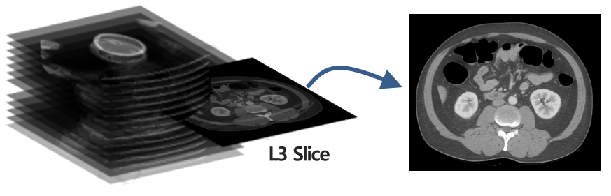

# MOAI 2020 Body Morphometry AI Segmentation Online Challenge

1st place solution for [MOAI 2020 Body Morphometry AI Segmentation Online Challenge.](https://www.kaggle.com/c/body-morphometry-for-sarcopenia/overview)

In this work, we present our **1st**place solution for MOAI 2020 Body Morphometry AI Segmentation Online Challenge. Our approach is based on U-net with a pre-trained Resnet34 as encoder.
To achieve better results we applied data-specific pre-processing and post-processing.


Team Members:  
Dayoung Baik, Hyebin Lee, Hwanseung Yoo, Junghwa Kang, Seungun Jang

## Objective

 Body morphometry-related diseases have the highest prevalence among all diseases. Particularly, changes in muscle, fat, and bone are the cause of many disease. So, the task of this challenge was to segment the subcutaneous fat, skeletal muscle, and visceral fat for the L3 slice of CT. (L3 slice is often used to evaluate the body composition.)


<div align="center">
  
</div>


## Data  
Consists of CT data in DCM format and Label data in PNG format. 

<div align="center">
  
</div>


## Method
### Pre-processing
- Add 4900 CT images manipulated with random windowing values  
  (window width: 500-1000, level value:-250-250)
- Apply random augmentations  
(random flipping, rotation, zooming, wrapping, random noise)

### CNN Network
- model : U-net with a pre-trained Resnet34 as encoder
- Input size : 512 X 512 X 3
- Loss Function : 0.5 * Generalized Dice Loss + 0.5 * Weighted Cross Entropy
- Batch size : 4
- Learning Rate : 3e-4
- The Number of traing epochs : 20
- Optimization method : Adam 

### Post-processing
- Apply hole Filling
- Utilize connected component to remove small objects

## Results

<div align="center">

  |  Input         |   Output          |
  |:--------------:|:-----------------:|
  | | |
  | | |
  | | |

</div>


## Dependencies
- fastai 1.0.61
- Python 3.6+
- scikit-image
- scipy 
- pydicom

## Getting Started
1. Clone this reposirotory
2. Preprocessing
    - Download [MOAI Challenge Data](https://www.kaggle.com/c/body-morphometry-for-sarcopenia/overview)

    - Run 

    ```
    python ./src/Pre-processing.py
    ```

3. Training  

    - Run ./src/train.ipynb

4. Inference  

    - Run ./src/inference.ipynb

## License  
This repository is licensed under the MIT License

## Acknowledgments  
This project used [fastai's tutorial notebook](https://github.com/fastai/course-v3/blob/master/nbs/dl1/lesson3-camvid.ipynb) template.
